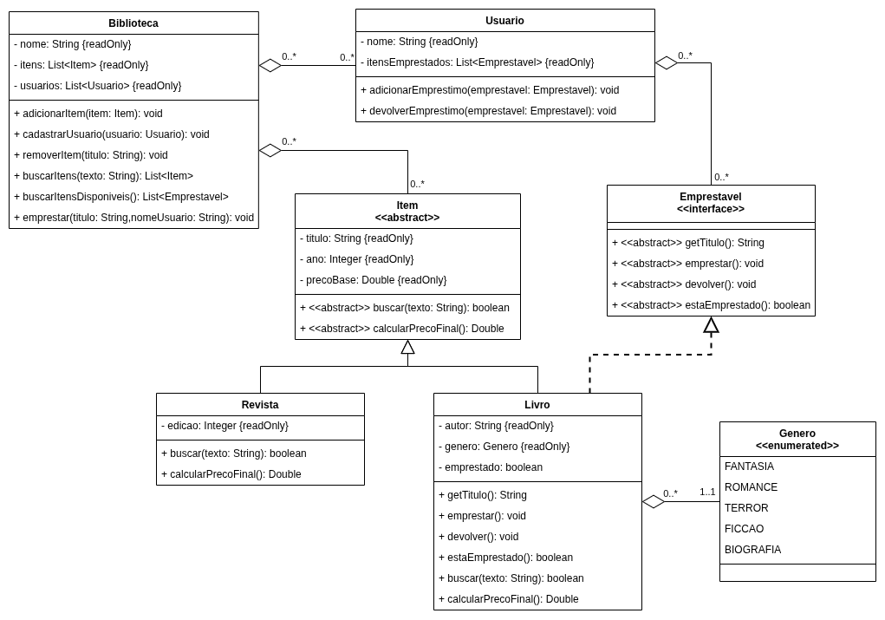

# Avaliação Continuada 03 - Prática 📚

## Orientações Gerais: 📝

1. Utilize **apenas** tipos **wrapper** para criar atributos e métodos.
2. **Respeite** os nomes de atributos e métodos definidos no exercício.
3. Tome **cuidado** com os **argumentos** especificados no exercício.
   **Não** adicione argumentos não solicitados e mantenha a ordem definida no enunciado.
4. Verifique se **não** há **erros de compilação** no projeto antes de enviar.
5. As classes devem seguir as regras de encapsulamento.

---

## Orientações Adicionais ⚠️

1. A classe `Main` não será avaliada, portanto, você pode utilizá-la para fazer testes manuais.
2. A classe `Main` possui exemplos de código que podem te ajudar no desenvolvimento.
3. Caso encontre erros nos testes unitários, avise o professor e, se for confirmado, o teste
   incorreto será desconsiderado para avaliação.

Boa sorte no desenvolvimento do sistema! 🚀

---

# Case: Biblioteca Digital 📖

Olá caro desenvolvedor,

Você foi contratado para desenvolver um sistema que irá auxiliar na gestão de uma biblioteca
digital.

O sistema deve permitir:

* cadastro de livros e revistas
* busca de itens
* empréstimo de livros
* controle de disponibilidade dos itens

Aqui está a especificação das classes do sistema:

---

# Enum `Genero`

Crie um enum chamado `Genero` com os seguintes valores:

* FANTASIA
* ROMANCE
* TERROR
* FICCAO
* BIOGRAFIA

---

# Classe `Item`

## Construtor

* `Item(String titulo, Integer ano, Double precoBase)`

    * Inicializa os atributos `titulo`, `ano` e `precoBase`.
    * Caso o `titulo` seja nulo ou tenha apenas espaços em branco, deve lançar `DadoInvalidoException`.
    * Caso o `ano` seja nulo ou menor que 1900, deve lançar `DadoInvalidoException`.
    * Caso o `precoBase` seja nulo ou negativo, deve lançar `DadoInvalidoException`.

---

## Métodos

* `Boolean buscar(String texto)`

    * Método abstrato que retorna `true` ou `false` se o texto for encontrado nos dados do item.

* `Double calcularPrecoFinal()`

    * Método abstrato responsável por retornar o preço final do item.

* Deve conter apenas getters para todos os atributos.

---

# Interface `Emprestavel`

Define um contrato para itens que podem ser emprestados.

## Métodos

* `String getTitulo()`

    * Método abstrato que retorna o título do item.

* `void emprestar()`

    * Método abstrato que marca o item como emprestado.

* `void devolver()`

    * Método abstrato que marca o item como disponível novamente.

* `Boolean estaEmprestado()`

    * Método abstrato que retorna `true` caso o item esteja emprestado.

---

# Classe `Usuario`

## Construtor

* `Usuario(String nome)`

    * Inicializa o atributo `nome`.
    * Inicializa a lista de itens emprestados como vazia.

---

## Métodos

* `void adicionarEmprestimo(Emprestavel emprestavel)`

    * Adiciona o item na lista de empréstimos.

* `void devolverEmprestimo(Emprestavel emprestavel)`

    * Remove o item da lista de empréstimos.

* Deve conter apenas getters para todos os atributos.

---

# Classe `Revista`

## Construtor

* `Revista(String titulo, Integer ano, Double precoBase, Integer edicao)`

    * Inicializa os atributos `titulo`, `ano`, `precoBase` e `edicao`.

---

## Métodos

* `Boolean buscar(String texto)`

    * Verifica se o texto informado está contido em qualquer parte do título da revista.
    * A busca não deve diferenciar letras maiúsculas e minúsculas.
    * O método deve retornar:
        * `true` caso o texto exista no título;
        * `false` caso contrário.

    * Exemplos:
        * Título: `"Revista de Ciência"`
            * `buscar("ciência")` → `true`
            * `buscar("REVISTA")` → `true`
            * `buscar("de")` → `true`
            * `buscar("história")` → `false`

        * Título: `"Tecnologia Hoje"`
            * `buscar("tec")` → `true`
            * `buscar("HOJE")` → `true`
            * `buscar("amanhã")` → `false`

* `Double calcularPrecoFinal()`

    * Retorna o preço final da revista.
    * Para calcular o preço final, todas as revistas possuem 20% de desconto no preço base.

* Deve conter apenas getters para todos os atributos.

---

# Classe `Livro`

## Construtor

* `Livro(String titulo, Integer ano, Double precoBase, String autor, Genero genero)`

    * Inicializa os atributos `titulo`, `ano`, `precoBase`, `autor` e `genero`.
    * Inicializa `emprestado` como `false`.

---

## Métodos

* `void emprestar()`

    * Caso o livro já esteja emprestado, deve lançar `EmprestavelIndisponivelException`.
    * Caso contrário, deve marcar o livro como emprestado, ou seja, setar emprestado como `true`.

* `void devolver()`

    * Marca o livro como disponível, ou seja, setar emprestado como `false`.

* `Boolean estaEmprestado()`

    * Retorna o estado atual do empréstimo, ou seja, `true` se o livro estiver emprestado e `false`
      caso contrário.

* `Boolean buscar(String texto)`

    * Verifica se o texto informado está contido em qualquer parte do título ou do autor do livro.
    * A busca não deve diferenciar letras maiúsculas e minúsculas.
    * O método deve retornar:
        * `true` caso o texto exista no título ou no autor;
        * `false` caso contrário.

    * Exemplos:
        * Livro:
            * Título: `"O Senhor dos Anéis"`
            * Autor: `"J.R.R. Tolkien"`

            * `buscar("anéis")` → `true`
            * `buscar("senhor")` → `true`
            * `buscar("tolkien")` → `true`
            * `buscar("J.R.R.")` → `true`
            * `buscar("harry")` → `false`

        * Livro:
            * Título: `"1984"`
            * Autor: `"George Orwell"`

            * `buscar("1984")` → `true`
            * `buscar("orwell")` → `true`
            * `buscar("geo")` → `true`
            * `buscar("rowling")` → `false`

* `Double calcularPrecoFinal()`

    * Retorna o preço final do livro.
    * Para incentivar a leitura de Biografias, os livros do gênero `BIOGRAFIA` devem ter um desconto
      de 20% no preço base.
    * Todos os outros livros devem ter o preço final igual ao preço base.

---

# Classe `Biblioteca`

## Construtor

* `Biblioteca(String nome)`

    * Inicializa o atributo `nome`.
    * Inicializa as listas de itens e usuários como vazias.

---

## Métodos

* `void adicionarItem(Item item)`

    * Caso o item seja nulo, deve lançar `DadoInvalidoException`.
    * Adiciona o item informado na lista de itens.

---

* `void cadastrarUsuario(Usuario usuario)`

    * Caso o usuário seja nulo, deve lançar `DadoInvalidoException`.
    * Adiciona o usuário informado na lista de usuários.

---

* `void removerItem(String titulo)`

    * Remove o item correspondente ao título informado.
    * A busca deve ignorar letras maiúsculas e minúsculas.
    * Caso o item não for encontrado, faça nada.

---

* `List<Item> buscarItens(String texto)`

    * Retorna todos os itens cuja busca retorne `true`.
    * Utilize o método abstrato `buscar` de cada item.

---

* `List<Emprestavel> buscarItensDisponiveis()`

    * Retorna todos os itens que não estão emprestados.
    * Ou seja, os itens que implementam `Emprestavel` e não estão emprestados.

---

* `void emprestar(String titulo, String nomeUsuario)`

    * Procura um usuário pelo nome.
    * Caso o usuário não seja encontrado, faça nada.
    * Procura um item pelo título.
    * O item:
        * deve implementar `Emprestavel`
        * não pode estar emprestado.
    * Caso encontrado:
        * marca o item como emprestado.
        * adiciona o item na lista de empréstimos do usuário.
    * Caso o item não seja encontrado, ou não seja emprestável, ou esteja emprestado, faça nada.

---

Você chegou ao fim desta jornada!

Agora vá em frente e codifique!

`[]~(📚)~*` ✨
